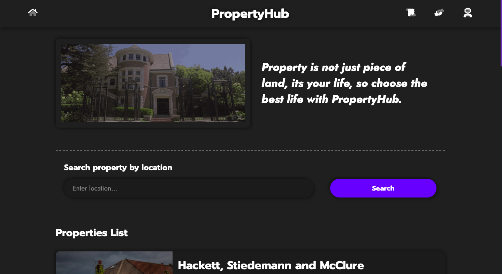
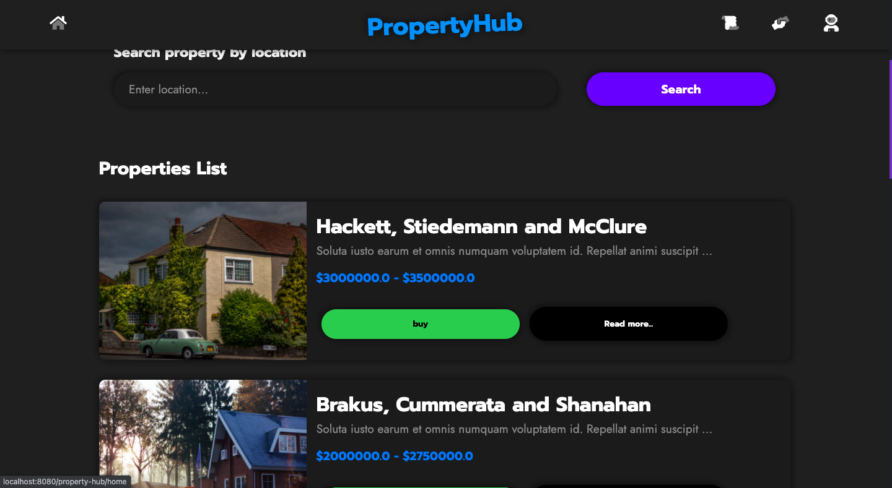
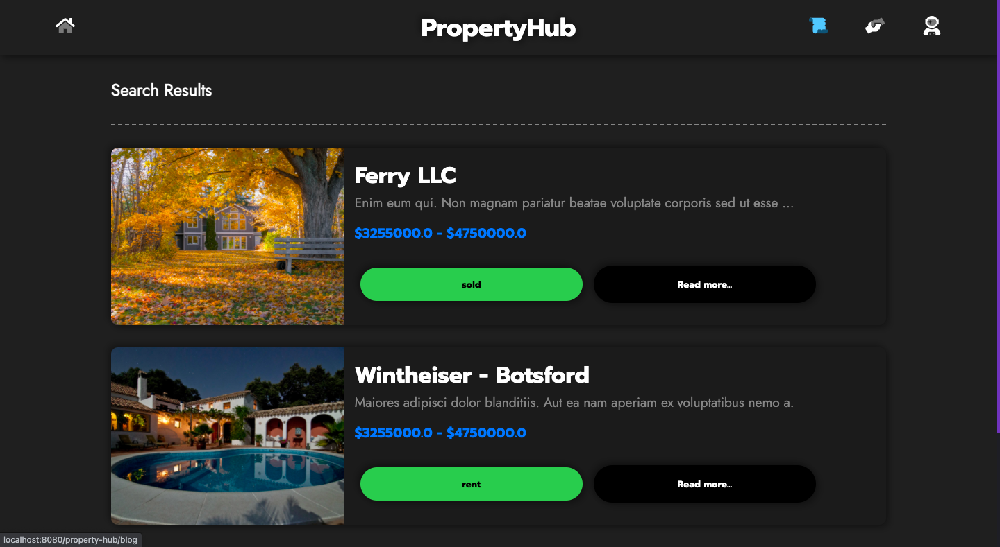
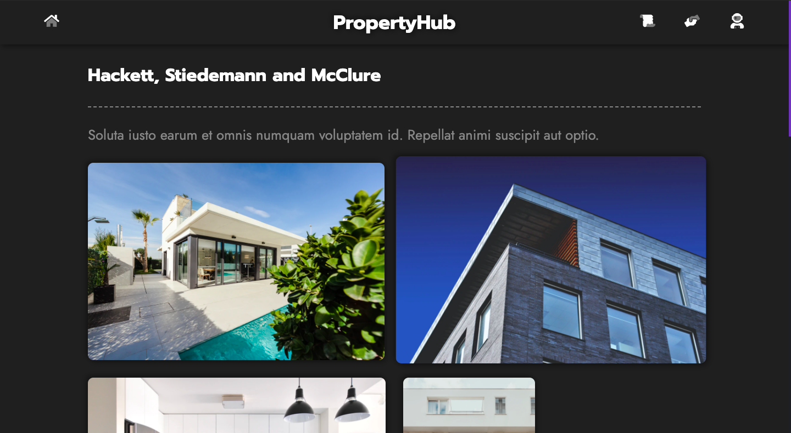
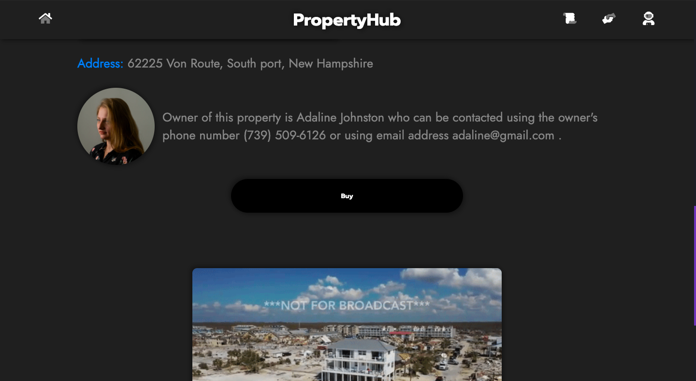
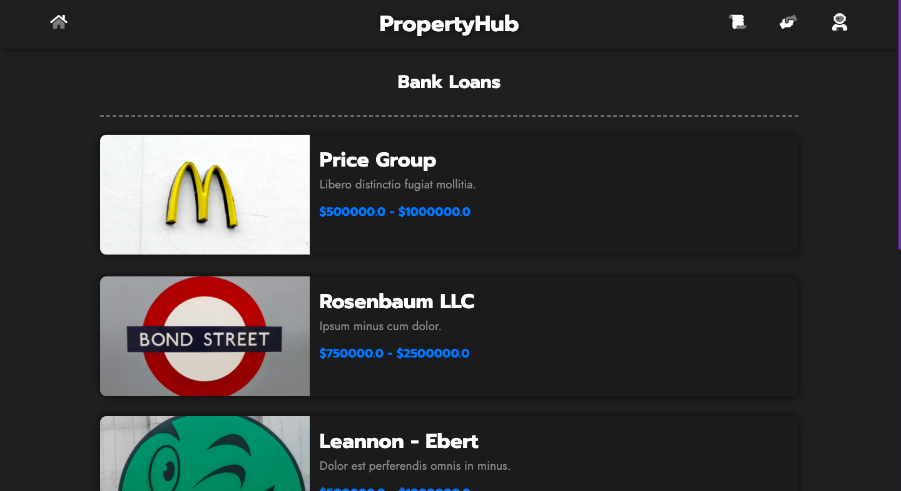
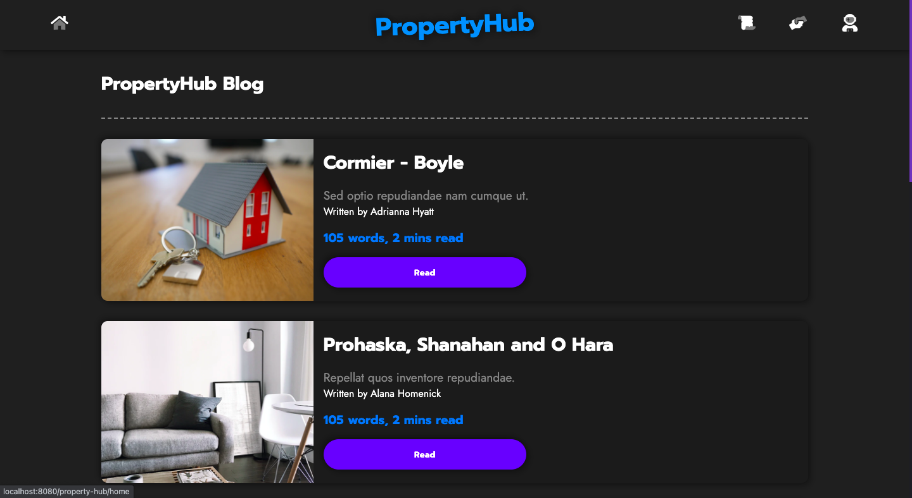
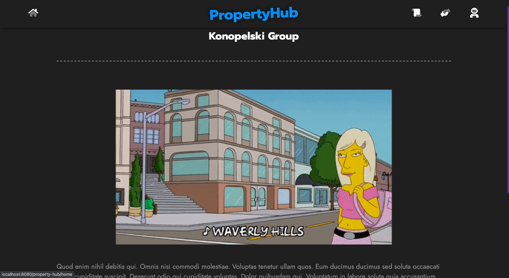
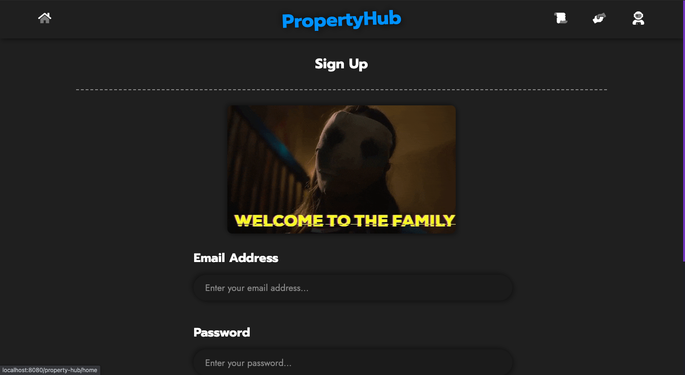
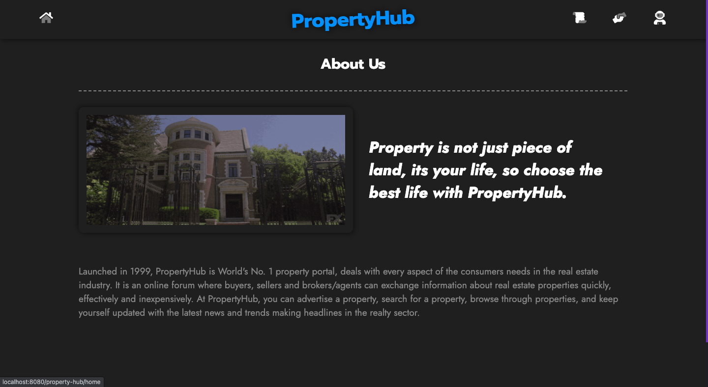

# property-hub

In this project `Java Express Edition` is used along with `My SQL`. This is a simple website where data of `property` is displayed in the frontend and the requests are processed in the backend. There is a simple `blog` section where data of the blog is just diplayed and simple registeration system where user can save their email and password, where the password is hashed using `sha256 hashing algorithm` and that `hash` and `salt` are saved.

This project uses `mysql` greatly and simple use of `servlets` and `jsp` to process and display the data from backend to frontend.

## Table of contents

- [Getting started](#getting-started)
- [Website images](#website-images)
- [License](#license)

## Getting started

To setup `Java`, `Apache Tomcat`, `Eclipse` and run `Java Web App` follow this [tutorial](https://www.youtube.com/watch?v=wDS4QgehTSI) (for both `Mac` and `Windows`).

For a beginner tutorial for `Java Express Edition` follow this [tutorial](https://www.youtube.com/watch?v=0dW577tJXkk&t=925s) where you will built `JSP` files, `Servlets` and connect `My SQL` as database.

The `mysql-connector-java` used to connect to the database and for `JSP` mordern syntax, `tablibs-standard-impl` and `tablibs-standard-spec` are used, all of these are available in this repo in the `src/webapp/WEB-INF/lib/` dir.

For `Apache Tomcat` follow this [tutorial](https://www.youtube.com/watch?v=wDS4QgehTSI) (for both `Mac` and `Windows`) `Apache Tomcat` section, the version used in this tutorial is used the same version of `Apache Tomact` used in this project i.e. `Apache Tomcat v9.0`.

For setting up the `my-sql` database follow this [tutorial](https://www.youtube.com/watch?v=wDS4QgehTSI) (for both `Mac` and `Windows`) `my-sql` section. For other commands for the project like creating database, user, permissions, creating table and dummy data, all are available in the `sql-commands.md` file.

**NOTE**: The website is not `responsive`.

## Website images

## License

[APACHE LICENSE, VERSION 2.0](./LICENSE)
